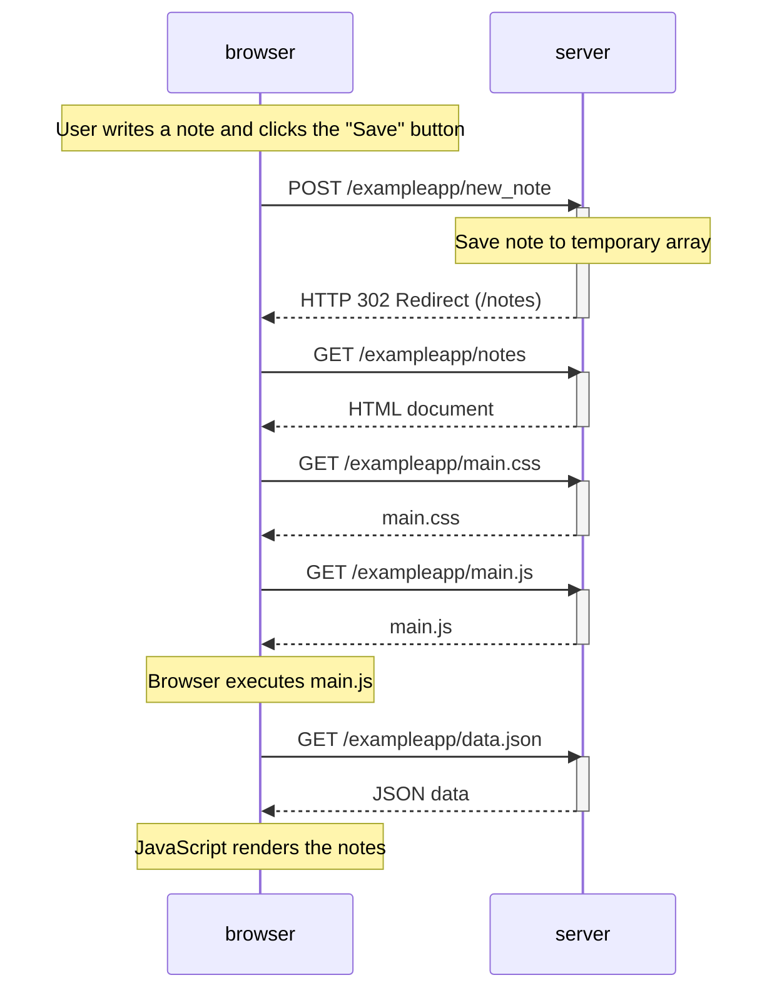

```mermaid
sequenceDiagram

Note over browser: User writes a note and clicks the "Save" button

browser->>server: POST /exampleapp/new_note
activate server
Note over server: Save note to temporary array
server-->>browser: HTTP 302 Redirect (/notes)
deactivate server

browser->>server: GET /exampleapp/notes
activate server
server-->>browser: HTML document
deactivate server

browser->>server: GET /exampleapp/main.css
activate server
server-->>browser: main.css
deactivate server

browser->>server: GET /exampleapp/main.js
activate server
server-->>browser: main.js
deactivate server

Note over browser: Browser executes main.js

browser->>server: GET /exampleapp/data.json
activate server
server-->>browser: JSON data
deactivate server

Note over browser: JavaScript renders the notes
```