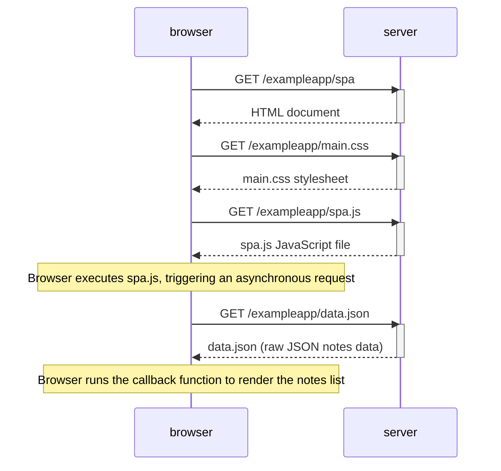

```mermaid
sequenceDiagram

browser->>server: GET /exampleapp/spa
activate server
server-->>browser: HTML document
deactivate server

browser->>server: GET /exampleapp/main.css
activate server
server-->>browser: main.css stylesheet
deactivate server

browser->>server: GET /exampleapp/spa.js
activate server
server-->>browser: spa.js JavaScript file
deactivate server

Note over browser: Browser executes spa.js, triggering an asynchronous request

browser->>server: GET /exampleapp/data.json
activate server
server-->>browser: data.json (raw JSON notes data)
deactivate server

Note over browser: Browser runs the callback function to render the notes list
```