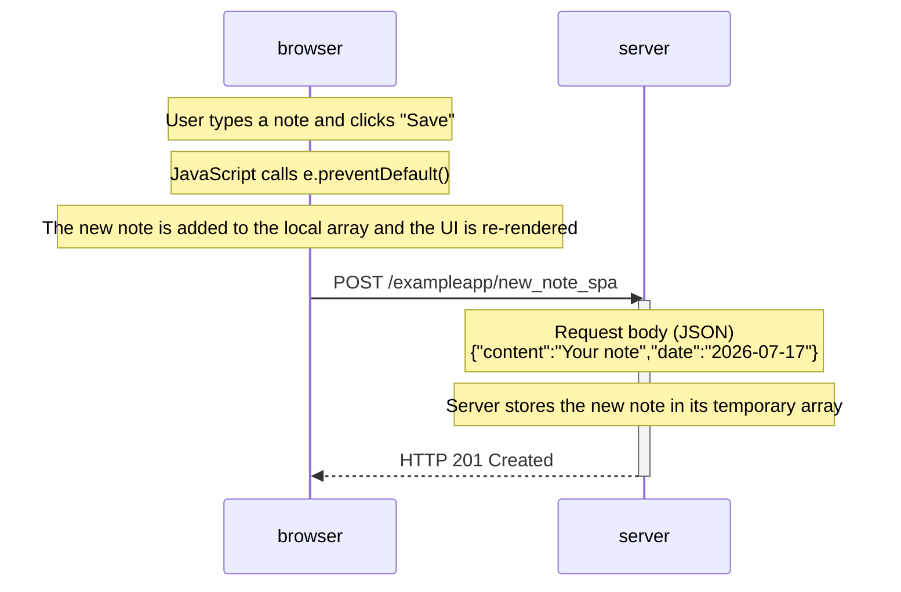

```mermaid
sequenceDiagram

Note over browser: User types a note and clicks "Save"
Note over browser: JavaScript calls e.preventDefault()
Note over browser: The new note is added to the local array and the UI is re-rendered

browser->>server: POST /exampleapp/new_note_spa
activate server

Note over server: Request body (JSON)<br/>{"content":"Your note","date":"2026-07-17"}
Note over server: Server stores the new note in its temporary array

server-->>browser: HTTP 201 Created
deactivate server
```